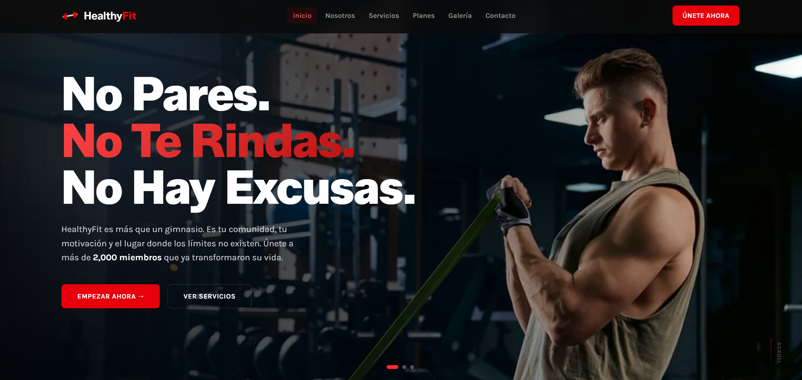

# HealthyFit 🏋️‍♀️✨

**HealthyFit (Remastered)** es la evolución de un proyecto personal que nació originalmente en React y ha sido refactorizado por completo utilizando **Astro**. La principal motivación detrás de esta migración fue construir una aplicación web más eficiente, enfocada en maximizar el rendimiento y ofrecer una experiencia de usuario (UX) de primer nivel a través de una arquitectura amigable y la generación de sitios estáticos (SSG).

## 📸 Vista Previa


*(Captura de pantalla de la nueva interfaz de HealthyFit)*

## 🛠️ The Remaster: Mejoras Clave

Esta nueva versión no solo cambia de stack tecnológico, sino que redefine la estructura del proyecto y su presentación visual, centrándose en métricas clave y usabilidad:

- **Migración de React a Astro (Generación Estática):** Al reemplazar el renderizado de cliente (CSR) de React por la generación estática de Astro, eliminamos la sobrecarga de JavaScript en el navegador. Esto resulta en tiempos de interacción casi instantáneos.
- **Implementación de Tailwind Animations:** Sustitución de librerías pesadas de animación basadas en JavaScript por animaciones nativas gestionadas íntegramente mediante CSS (`tailwind-animations`). Las transiciones y micro-interacciones ahora son fluidas, altamente eficientes y no bloquean el hilo principal (Main Thread).
- **Optimización Integral de Imágenes:** Resolvimos los problemas de carga lenta y métricas LCP deficientes de la versión anterior mediante la implementación del componente nativo `<Image />` de Astro. Esto asegura el procesamiento y entrega en formatos de próxima generación (como WebP), optimización automática de dimensiones y carga diferida (lazy loading) por defecto.
- **Arquitectura de la Información y CTAs:** Reestructuración completa del código en un sistema altamente modular (`/components/layout/`, `/sections/`, `/ui/`). Se mejoró la jerarquía de la información y se integraron botones de llamada a la acción (Call to Action) estratégicos para guiar al usuario, mejorando la retención y la tasa de conversión.
- **Diseño UI Limpio y Minimalista:** Rediseño centrado en los principios de minimalismo funcional. Se priorizó una paleta de colores cohesiva, excelente legibilidad tipográfica y una navegación fluida e intuitiva que transmite la profesionalidad de un gimnasio moderno.

## ⚡ Performance (Métricas)

La obsesión por la calidad técnica y el rendimiento se refleja en las auditorías de **Lighthouse**:

- 🖥️ **Desktop:** **98** / 100
- 📱 **Mobile:** **94** / 100

Estas puntuaciones garantizan que los usuarios experimenten una navegación rápida, sin bloqueos visuales y completamente accesible desde cualquier dispositivo.

## 💻 Tecnologías

El proyecto ha sido orquestado apoyándose en las siguientes herramientas clave:

- **Astro (`v6.1.9`)** - Framework web y motor principal para la generación de contenido estático y optimización por defecto.
- **Tailwind CSS (`v4.2.4`)** - Framework de CSS basado en utilidades que permite un diseño ágil, responsivo y completamente predecible.
- **Tailwind Animations (`v1.0.1`)** - Extensión para implementar animaciones y transiciones de alto rendimiento mediante CSS.
- **Antigravity** - Asistencia avanzada de IA empleada durante las fases de refactorización, optimización de código y estructuración de la nueva arquitectura.

## 🚀 Instalación y Uso

Para explorar y ejecutar este proyecto de forma local, ejecuta los siguientes comandos estándar de npm:

```bash
# 1. Clonar el repositorio
git clone <URL_DEL_REPOSITORIO>

# 2. Navegar al directorio del proyecto
cd healthyfit

# 3. Instalar todas las dependencias
npm install

# 4. Iniciar el servidor de desarrollo local
npm run dev
```

El proyecto estará disponible para su previsualización en `http://localhost:4321`.

---
*Diseñado y desarrollado con un enfoque intransigente en el rendimiento, código limpio y una experiencia de usuario (UX) excepcional.*
